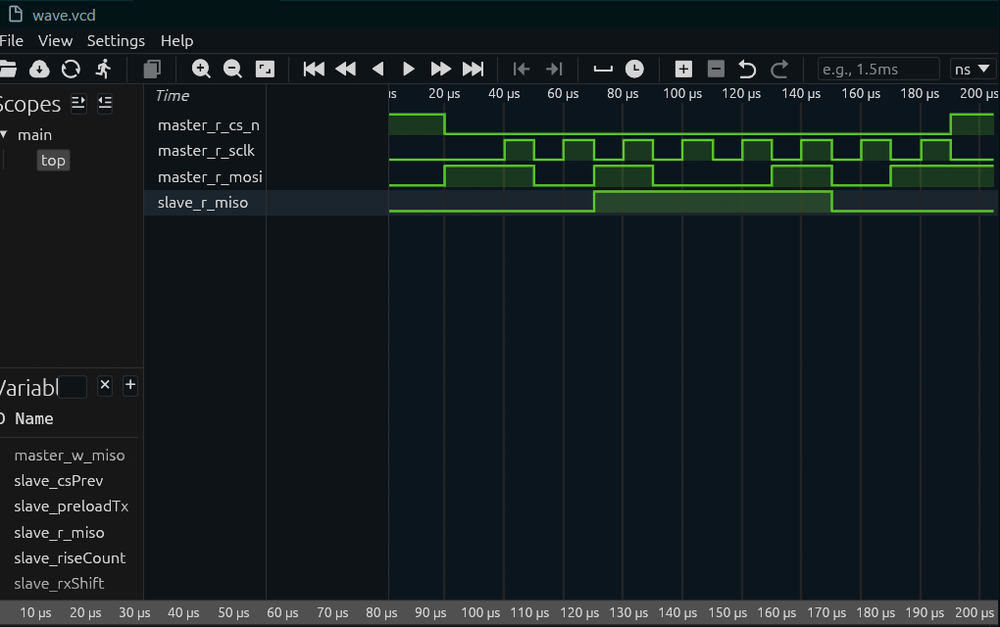

# Bluespec SystemVerilog SPI Project

本项目使用 Bluespec SystemVerilog 实现 SPI 主从通信（Mode 0），并使用 Bluesim 进行仿真与波形导出。

## Quick Start

```bash
# 激活开发环境
direnv allow  # 或 nix develop

# 清理并运行 Bluesim（会生成 wave.vcd）
make clean
make bluesim

# 查看波形
gtkwave wave.vcd
```

## Project Structure

```text
.
├── flake.nix
├── .envrc
├── Makefile
├── README.md
├── bsv_src/
│   ├── SPICommon.bsv   # SPI 主从接口定义
│   ├── SPIMaster.bsv   # SPI 主机实现
│   ├── SPISlave.bsv    # SPI 从机实现
│   └── Top.bsv         # 顶层连线 + 测试台
└── build/              # Bluesim 生成目录
```

## Simulation Targets

- make bluesim: 编译并运行 Bluesim，同时导出 wave.vcd
- make verilog: 生成 Verilog（可选）
- make clean: 清理编译与波形产物

## Waveform Signals to Observe

最能体现 SPI 协议的 4 根核心线：

- master_r_cs_n
- master_r_sclk
- master_r_mosi
- slave_r_miso

推荐辅助信号：

- master_bitIdx
- master_active
- master_rxShift
- slave_riseCount
- slave_rxShift
- state



## Verified Run Result

以下是当前实现的实际仿真日志（Bluesim）：

```text
✅ Run Bluesim and generate waveform: wave.vcd
./build/out -V wave.vcd
[10] TB: Slave preload TX=0x3C
[20] TB: Start SPI transfer, Master TX=0xA5
[200] TB: Master RX=0x3c (expect 0x3c)
[210] TB: Slave  RX=0xa5 (expect 0xa5)
[210] TB: PASS
```

说明：

- 主机发送 0xA5，从机成功接收 0xA5
- 从机发送 0x3C，主机成功接收 0x3C
- 协议时序与数据收发均通过验证
